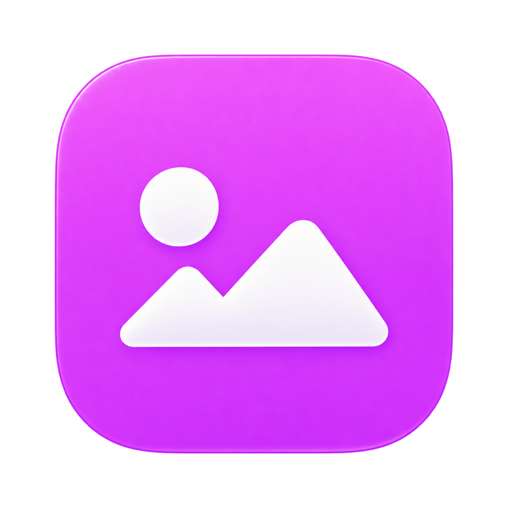

# 08. Иконки инструментов — стиль и генерация

Самостоятельный гайд для дизайнера, frontend-разработчика и генеративного ассистента. Версия 1.0 · 29.09.2026. Эталон — файлы, фактически подключённые в `ai-hub`, а не ранние наборы из `output/icons`.

## Что мы создаём

Иконка инструмента — маленькая объёмная цветная плитка с одним узнаваемым белым символом. Она различает режимы продукта и остаётся читаемой в сайдбаре на 20 px и в компактных тарифных строках на 16 px. Это отдельная графическая система: меню, крестик, стрелки и другие действия используют Hugeicons; их не нужно превращать в объёмные картинки.

Характер: гладкая сатиновая эмаль, неглубокий рельеф, мягкая полированная фаска, небольшой верхний левый блик и деликатный нижний внутренний отблеск. Изображение объёмное, но смотрит на пользователя почти строго фронтально. Не нужны заметная перспектива или изометрический куб.

## Эталонный набор — приложить к генерации

| Инструмент | Референс master | Файл в UI | Визуальная семантика |
| --- | --- | --- | --- |
| Текст | [text-primary.png](references/icons/text-primary.png) | [sm/text-primary.png](../../public/icons/sm/text-primary.png) | Фиолетовая плитка, белая засечковая T |
| Фото | [photo.png](references/icons/photo.png) | [sm/photo.png](../../public/icons/sm/photo.png) | Яркая магента, две горы и солнце |
| Видео | [video.png](references/icons/video.png) | [sm/video.png](../../public/icons/sm/video.png) | Оранжевая плитка, белая видеокамера |
| Аудио | [audio.png](references/icons/audio.png) | [sm/audio.png](../../public/icons/sm/audio.png) | Синяя плитка, одиночная восьмая нота |
| Карусель | [carousel.png](references/icons/carousel.png) | [sm/carousel.png](../../public/icons/sm/carousel.png) | Мятно-бирюзовая плитка, перекрывающиеся карточки |
| Тренды | [trends.png](references/icons/trends.png) | [sm/trends.png](../../public/icons/sm/trends.png) | Золотисто-янтарная плитка, пламя |




Для новой иконки приложить минимум `photo.png` и `video.png` как эталон формы/материала; при фиолетовом цвете — дополнительно `text-primary.png`. Передавать сами изображения, а не только их названия. При генерации варианта существующей иконки приложить её текущий master первой и отдельно описать допустимое изменение.

### Где используется набор

- Sidebar: Фото/Видео/Аудио и дополнительные инструменты — 20 px. «Новый чат» использует Hugeicon; фиолетовая T не заменяет эту кнопку.
- Глобальный поиск: иконки инструментов, включая Текст, — 32 px.
- Меню «+»: 18 px desktop, 24 px mobile.
- Тарифные карточки: 16 px; недоступное видео в «Промо» использует существующее `grayscale opacity-40`.
- Пустая студия: отдельное увеличенное представление 29.25 / 36 px.

**Не перепутать версии.** Исторический `krea-sidebar-v3/generation-spec.md` описывал фиолетовое видео и оранжевый текст. В текущем продукте видео оранжевое, а текст использует фиолетовый `text-primary.png`. Старый `text.png` и неиспользуемые файлы не являются поводом менять текущую палитру. Строка «Роли» сейчас использует векторный `SignpostIcon`, даже если растровый `roles.png` сохранён в public.

## Инварианты стиля

| Свойство | Правило |
| --- | --- |
| Силуэт | Квадрат 1:1 с мягкими непрерывными углами; равные ширина и высота плитки |
| Ракурс | Фронтальный, без наклона всей плитки и видимой боковой стенки |
| Материал | Непрозрачная цветная сатиновая эмаль; едва заметная глубина |
| Свет | Мягкий студийный верхний левый источник; тонкий кант и мягкий внутренний отблеск снизу |
| Цвет | Один узнаваемый цвет семейства, плавный тональный переход внутри него |
| Символ | Один простой жемчужно-белый знак, оптически по центру; мягкий низкий рельеф |
| Детализация | Силуэт узнаётся на 20 px; без надписей, миниатюрных штрихов, двойной метафоры |
| Фон | Настоящий alpha, без белого/чёрного квадрата, шахматки или фонового свечения |
| Тени | Нет внешней падающей тени; допустим внутренний рельеф символа |
| Согласованность | Размер плитки и оптическая масса символа сверяются с соседними иконками |

Нельзя: широкая стеклянная рамка; яркая белая округлая рамка внутри плитки; полупрозрачное стекло; зерно, облака, пузыри; неоновый ореол; хром; пластилиновая игрушка; плоская заливка без существующей фаски; несколько значков; фотографический фон; мелкие буквы. Слово «3D» само по себе недостаточно: генератор должен видеть точные референсы.

Цветовые ориентиры для новых assets: фиолетовый около `#7A3FFF`, магента около `#DC3FFF`, оранжевый около `#FF723F`, синий около `#3F8CFF`, мятный→бирюзовый около `#40DFBD`→`#119C94`, золото→янтарь около `#FFD449`→`#FF941F`. Это направления художественного рендера из семейства, **не обещание однородной RGB-заливки и не новые CSS-токены**. Для совпадения важнее PNG-референс. Цвет UI-кнопок остаётся primary и не зависит от цвета инструмента.

## Бриф новой иконки

Заполнить перед генерацией:

```text
Инструмент: [название]
Действие: [что пользователь получает, 1 предложение]
Одна метафора: [один простой символ]
Цвет: [цвет семейства; если новый — почему существующие не подходят]
Референсы: [photo.png, video.png, при необходимости text-primary.png]
Выход: один отдельный RGBA PNG, прозрачный фон
Использование: tariff 16 px, sidebar 20 px, search 32 px
Нельзя менять: квадрат, фаску, материал, направление света, визуальную массу
```

Пример новой метафоры, **не новый утверждённый инструмент**: «Перевод» → один лаконичный знак двух речевых форм, без флагов и текста. Если на 20 px получается пятно, упростить метафору до генерации. Не добавлять инструмент в навигацию только потому, что для него нарисована иконка.

## Шаблон промпта для новой иконки

Это воспроизводимый шаблон, составленный для handoff; он не выдаётся за исходный промпт исторической генерации.

```text
Create ONE production-ready tool icon for AI Hub.

REFERENCE ROLES
Image 1 (photo.png): exact tile geometry, continuous rounded corners,
front-facing camera, shallow bevel and satin enamel material.
Image 2 (video.png): exact light direction, pearl-white raised symbol,
subtle lower inner gleam and restrained depth.
Image 3, if provided: color-family reference only.

NEW ICON
Tool: [TOOL NAME].
Meaning: [ONE SHORT DESCRIPTION].
Symbol: [ONE SIMPLE SILHOUETTE].
Tile hue: [COLOR DIRECTION].

INVARIANTS
Match the reference family as a sibling asset, not a reinterpretation.
Perfectly square tile before any export, front facing, centered.
Smooth opaque satin enamel, shallow polished bevel, continuous soft corners.
Fine upper-left edge reflection, subtle internal lower gleam.
One centered opaque pearl-white symbol with very shallow soft relief.
Clear silhouette at 20 px, similar optical weight to the references.

DELIVERY
One standalone image. True transparent alpha background.
Master target: 1024 × 1024 px; tile target: 804 × 804 px,
centered with 110 px transparent padding on each side.
Preserve the full silhouette. No surrounding cast shadow.
No label, no layout sheet, no watermark, no UI mockup.

AVOID
Perspective, isometric cube, skew, rectangular tile, thick glass frame,
bright inset white border, glass transparency, grain, noise, clouds,
bubbles, neon halo, metallic chrome, extra objects, decorative text.
```

В инструменте генерации нужно отдельно включить прозрачный фон (`transparent_background: true`, если такой параметр доступен). Указание прозрачности в тексте не заменяет проверку alpha. Если генератор вернул другой размер, не растягивать плитку по одной оси: сохранить raw и нормализовать экспорт равномерно.

### Промпт исправления

```text
Edit only [SPECIFIC DEFECT] in the supplied candidate.
Keep the tile shape, 1:1 proportions, camera, satin enamel material,
rounded corners, hue, light direction, symbol identity and alpha unchanged.
Match reference image [N]. Do not add objects, text, outer shadow or background.
Return one corrected standalone transparent image.
```

Одна итерация — одна конкретная правка: «убрать белую рамку», «увеличить символ», «сделать плитку квадратной». После каждой правки проверить инварианты повторно: улучшение одного признака не должно менять остальные.

## Master и runtime — разные экспорты

Стандартные текущие masters `photo/video/audio/carousel/trends` имеют 1024×1024, RGBA; alpha-bounds плитки — `[110,110,914,914)` (правая/нижняя граница не включается), то есть 804×804. Поля master сохранять.

Рабочие assets в `public/icons/sm/` — 96×96. У плиток padding master убран перед уменьшением: они заполняют квадрат почти целиком. Поэтому **нельзя просто уменьшить весь master до 96 px**: новая иконка окажется визуально меньше соседних.

Точное исключение: текущий `text-primary.png` имеет 1254×1254; значимая непрозрачная плитка при alpha ≥128 занимает примерно 985×985. Слабые alpha-пиксели вне плитки дают более широкий bbox. Его не нужно переписывать ради нормализации; для подключения брать уже подготовленный `sm/text-primary.png`.

Для новой нормализованной плитки 1024/804 на macOS пример экспорта **в новый файл**:

```sh
mkdir -p public/icons/sm
sips -c 804 804 public/icons/new-tool.png --out public/icons/sm/new-tool.png
sips -z 96 96 public/icons/sm/new-tool.png
```

Эти команды допустимы только после проверки размера и положения плитки. Для другого исходного размера сначала определить crop визуально и измерением; не применять 804 ко всем файлам автоматически. `folder.png` — предметный силуэт папки, не квадратная плитка, и требует сохранения собственных пропорций.

## Подключение к frontend

Каталог — [tools.ts](../../src/data/tools.ts); отображение — [sidebar-nav.tsx](../../src/components/sidebar-nav.tsx), поиск — [chat-search.tsx](../../src/components/chat-search.tsx). Новый путь строить через `withBasePath`:

```tsx
// Иллюстративный элемент каталога, не готовый новый маршрут.
{
  id: "new:approved-tool-id",
  label: "Название инструмента",
  icon: withBasePath("/icons/sm/new-tool.png"),
  description: "Короткое описание результата",
}
```

Для нового инструмента отдельно добавить поддерживаемые типы/route/экран: один элемент массива сам по себе не создаёт рабочий сценарий. Изображение рядом с текстовым названием декоративное (`alt=""`); у кнопки должно быть доступное имя. Не перекрашивать активный PNG через CSS, не добавлять border/shadow/gradient поверх готовой плитки. Существующее disabled-представление видео в тарифе «Промо» (`grayscale opacity-40`) сохраняется как UI-состояние, а не отдельная версия ассета. Одна версия PNG используется в light/dark.

## Приёмка иконки

- [ ] Символ описывается одним словом и читается на 16, 20 и 32 px без увеличения.
- [ ] Плитка 1:1, фронтальная, не вытянута; совпадает размер и оптическое центрирование с Фото/Видео.
- [ ] Углы, фаска и направление блика принадлежат тому же набору.
- [ ] Нет внешней тени, шахматки, белого ореола, обрезанного края или случайного alpha-мусора.
- [ ] Проверена на реальных светлой и тёмной поверхностях sidebar и поиска.
- [ ] Master и runtime PNG сохранены отдельно; runtime 96×96 не содержит лишних полей.
- [ ] Имя файла латиницей kebab-case; старые файлы не перезаписаны до выбора результата.
- [ ] Сохранены prompt, reference paths, дата, способ генерации/редактирования и статус выбора.
- [ ] Обновлены реестр ассетов и скриншот ряда инструментов.

Пакет одного нового инструмента: `new-tool.png`, `sm/new-tool.png`, `new-tool-generation.md` с брифом/промптом/референсами, preview на светлом и тёмном фоне. Проверка геометрии и прозрачности обязательна: генерация не гарантирует точных размеров или идентичности пикселей.
